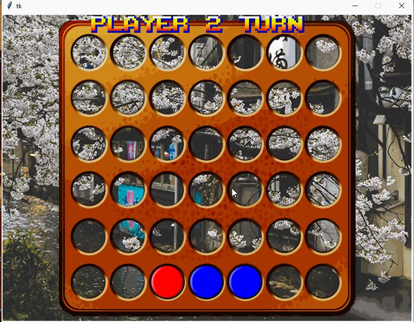

# PythonGame-connect-4
### One of my very first projects in python
###### My first attempt at programming a GUI interface using python for a game using python's Tkinter as a tool
Since for me this was mostly a GUI project i wanted it to be visually pleasing as much as i could by including a GIF at the start of the screen.
The code is entirely built from scratch using tkinter combined with trail and error to produce a user interactive gui

user interaction:

